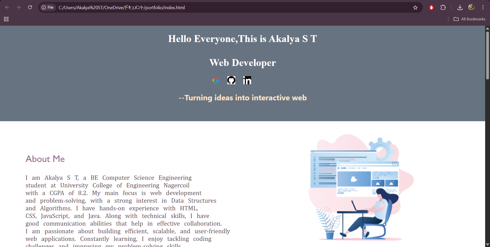

# 🌐 Akalya's Portfolio Website

Welcome to **Akalya S T's Portfolio Website**, a responsive and interactive portfolio built using **HTML** and **CSS**. This project is designed to showcase my profile, technical and non-technical skills, and personal web development projects.

## 📂 Project Structure

```
├── index.html          # Main HTML file
├── style.css           # Styling for the website            
│   ├── google logo2.png
│   ├── github logo2.png
│   ├── linkedin logo2.png
│   ├── girl.png
│   ├── project1.jpg
│   ├── project2.jpg
│   ├── project3.png
│   └── project4.jpg
└── akalya resume.pdf   # Downloadable resume link (optional)
```

---

## ✨ Features

- 💬 **Intro Section** with a warm greeting and social media icons
- 👩‍💻 **About Me Section** highlighting academic background and career focus
- 🛠️ **Skills Section** categorized into Technical and Non-Technical skills
- 📁 **Projects Section** with visuals and project descriptions:
  - Netflix Homepage
  - Calculator
  - Amazon Landing Page
  - Coffee Shop Website
- 📄 **Resume Download** button
- 📬 **Contact Section** with phone, email, and LinkedIn
- 📱 **Responsive Design** for mobile and tablet views using media queries

---

## 🧰 Built With

- HTML5
- CSS3
- Responsive Web Design techniques

---

## 🖼️ Preview Screenshot



```

---

## 📌 How to Use

1. Clone or download the repository
2. Open `index.html` in any browser to view locally
3. Edit content in `index.html` and `style.css` to personalize

---

## 📧 Contact

- Email: [akalyaakalyaa590@gmail.com](mailto:akalyaakalyaa590@gmail.com)
- LinkedIn: [Akalya S T](https://www.linkedin.com/in/akalya-s-t-8aaba12a0/) 

---

## 📜 License

This project is for personal and educational use only.
